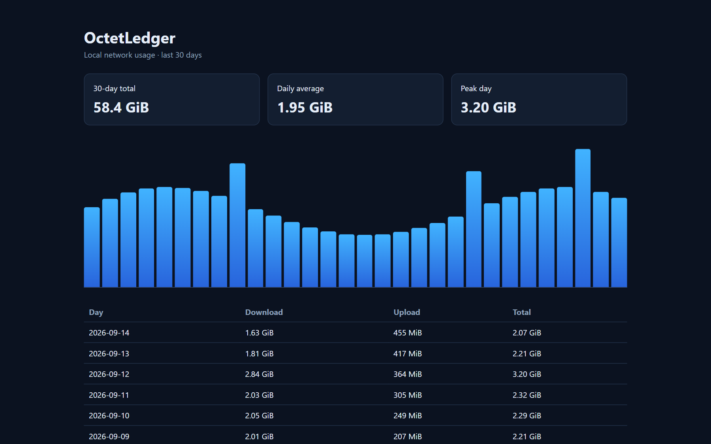

# OctetLedger

[](https://github.com/Roman-Cuisset/octet-ledger/actions/workflows/build.yml)
[](https://github.com/Roman-Cuisset/octet-ledger/releases/latest)
[](https://github.com/Roman-Cuisset/octet-ledger/releases)
[](LICENSE)

**A privacy-first vnStat-style bandwidth monitor for Windows.**

OctetLedger keeps a local history of upload and download usage without capturing packets. It reads
Windows interface counters, stores only counter differences in SQLite, and turns them into useful
hourly, daily, monthly, budget, comparison, and dashboard views.

## Why OctetLedger?

| | OctetLedger |
|---|---|
| Privacy | No sites, IP addresses, or packet contents recorded |
| Setup | Per-user installation; no service account and no Administrator rights |
| Overhead | One counter sample per minute; no continuous packet capture |
| Ownership | Offline-first SQLite database under your Windows profile |
| Reporting | CLI, JSON, CSV, budgets, comparisons, and a local dashboard |
| Recovery | Integrity checks, automatic backups, safe updates, and rollback |

The normal collector never inspects individual connections. Optional per-application estimates are
captured only when the user explicitly starts an elevated ETW monitoring window.

## Quick start

1. Download the correct ZIP from the [latest release](https://github.com/Roman-Cuisset/octet-ledger/releases/latest).
2. Extract it and run `install.cmd`.
3. Open a new terminal:

```powershell
octetledger doctor
octetledger today
octetledger dashboard
```

The first sample establishes a baseline; recorded traffic appears after the next one-minute sample.



## Install

Download the x64 or ARM64 ZIP from GitHub Releases, extract it, and run `install.cmd`. The installer
needs no administrator privileges, adds `octetledger` to the user PATH, and starts an invisible
collector every 60 seconds through the current user's Windows startup configuration.

Once the WinGet package is accepted, these commands will also work:

```powershell
winget install --id RomanCuisset.OctetLedger --exact
winget install octetledger
```

For a WinGet portable installation, start background collection once with:

```powershell
octetledger collector install
```

## How to read the numbers

OctetLedger exposes two different kinds of network data:

| Commands | Source | Lifetime |
|---|---|---|
| `octetledger`, `summary`, `interfaces`, `live` | Current counters reported directly by Windows | Usually since each network adapter was initialized; counters can reset after a reboot, driver restart, or adapter disable/enable |
| `today`, `hourly`, `daily`, `weekly`, `monthly`, `total`, `dashboard` | Counter differences periodically recorded by OctetLedger | Persistent across reboots and adapter resets in `%LOCALAPPDATA%\OctetLedger` |

The Windows counters are the raw source, not historical reports. The first OctetLedger collection
establishes a baseline; later collections store the differences. Use `interfaces` to inspect what
Windows sees now, `live` for current transfer rates, and the stored-report commands for usage history.

Stored reports keep physical Wi-Fi and Ethernet rows separate. By default they exclude VPN and
virtual adapters because those can represent the same traffic a second time; use `--all` when those
interfaces are intentionally needed.

## Commands

```powershell
# Live Windows counters (can reset after reboot, driver restart, or adapter change)
octetledger                              # Primary interface counters
octetledger summary --all                # All active interfaces
octetledger interfaces                   # List interfaces and counters
octetledger interface set "Wi-Fi"        # Save the default interface
octetledger live                         # Real-time rate between counter reads

# Recorded OctetLedger history (persistent across reboots)
octetledger total                        # All recorded traffic since the beginning
octetledger today                        # Today's stored traffic
octetledger hourly --hours 24
octetledger daily --days 30
octetledger weekly --weeks 12
octetledger monthly --months 12
octetledger top --days 10

octetledger daily --json
octetledger monthly --csv report.csv
octetledger daily --all                  # Explicitly include every interface

octetledger collector status
octetledger collector install
octetledger collector stop
octetledger collector start
octetledger collector uninstall

octetledger database check
octetledger database export D:\Backups\octetledger.db
octetledger database import D:\Backups\octetledger.db
octetledger database retention 90
octetledger database vacuum
octetledger database auto-backup enable

octetledger budget set 500GB
octetledger budget status
octetledger compare today yesterday
octetledger compare this-month last-month
octetledger dashboard
octetledger apps top --days 30
octetledger apps monitor --seconds 60   # Administrator terminal required

octetledger version --verbose
octetledger doctor                       # Full diagnostics with interface coverage
octetledger status                       # Windows vs OctetLedger data, collector health
octetledger update check
octetledger update install
octetledger update rollback
octetledger update status
octetledger update disable
octetledger daily --data-dir .\portable-data

Stored reports include every physical Wi-Fi/Ethernet interface by default, so switching from Wi-Fi
to Ethernet does not hide earlier traffic. VPN and virtual adapters are excluded to avoid duplicate
transport traffic. Use `--interface` to pin one adapter or `--all` to inspect every stored adapter;
rows remain separate and are never merged into a misleading grand total.

The first collection creates a baseline. Traffic is recorded from the next sample onward. Data and
settings live in `%LOCALAPPDATA%\OctetLedger`. Uninstalling the program preserves these files.
If a stored report detects that automatic collection is stopped, it prints a warning and the repair
command. Background collection retries transient errors and records them in `collector.log` instead
of silently exiting.

Collector health is based on the latest successful collection, not only on the presence of a
process. `Running, collection delayed` means that the process exists but no collection has
succeeded for more than three minutes. `Running, retrying after errors` exposes repeated failures
while the last success is still recent. The status includes consecutive errors and points to the
log. Process control records the PID, process start time, and executable path, so another
`octetledger` command cannot be stopped as if it were the collector.

Stored traffic is attributed to the time at which the counter difference is observed. OctetLedger
also stores the real elapsed time since the preceding observation. `Peak avg` is therefore the
highest average over an observed interval, not an instantaneous packet-level peak. Reports warn
when an interval exceeds 90 seconds. OctetLedger does not invent a minute-by-minute distribution
for traffic that occurred while the computer was asleep or collection was interrupted, so that
traffic may appear in the hour or day in which collection resumes.

Report interface selection uses physical interfaces that actually contain data in the requested
period. An explicit `--interface` filter is applied before `top` ranks days. Unknown options,
missing option values, and extraneous arguments return exit code 2.

Monthly budgets report current usage, remaining capacity, 75/90/100-percent warnings, and a
projection based on elapsed days. `compare` reports period-over-period change and a month-end
projection. `database retention` preserves older totals in daily aggregates before removing raw
minute rows; `database vacuum` reclaims SQLite space.

`dashboard` serves a read-only dashboard on `http://127.0.0.1:8765` and never binds to a network
interface. `--data-dir` selects an isolated database and settings directory for portable use.
Portable data directories deliberately do not control the registered per-user collector: use
explicit `collect` calls or keep `monitor` running with the same `--data-dir`.

Per-application tracking is opt-in. `apps monitor` uses Windows kernel ETW process, TCP/IP, and
UDP/IP events and therefore requires an Administrator terminal. It stores hourly estimated payload
bytes by process name only for the explicit monitoring window; `apps top` reads those totals. The
estimates can differ from interface counters and are not billing-grade measurements. Normal
interface collection does not require elevation and does not capture process activity.

## Machine-readable output

`--json` writes a JSON array to standard output. Each row contains stable camel-case fields:
`period`, `interfaceId`, `interfaceName`, `bytesReceived`, `bytesSent`, `totalBytes`,
`averageBytesPerSecond`, `peakBytesPerSecond`, and `longestIntervalSeconds`. Byte values are integer
counts; rates and intervals are numeric bytes-per-second and seconds. New fields may be added in
future minor releases, but existing field names and units will not change without a major release.

`--csv` writes the same data with invariant-culture numbers and a UTF-8 byte-order mark. Text cells
that could be interpreted as spreadsheet formulas are prefixed with an apostrophe.

## Updates

Run `octetledger update check` to query the latest stable GitHub release. `octetledger update
install` downloads the package for the current x64 or ARM64 architecture, applies a body timeout
and size limit, verifies its published SHA-256 checksum, rejects unsafe archive paths, validates
the downloaded executable version, and then delegates replacement to the rollback-capable
installer. The previous executable is retained for `octetledger update rollback`.

Interactive `summary` and `status` commands check at most once every 24 hours and print a short
notice when a newer version exists. Failed offline attempts are throttled too. Automatic checks
use a two-second timeout, never make the local command fail, and never download or install
anything. Use `octetledger update disable` or `octetledger update enable` to control these checks.
Installation always requires the explicit `update install` command.

## Backup and restore

`database export` creates a consistent SQLite backup; `database import` verifies and restores it:

```powershell
octetledger database export D:\Backups\octetledger.db
octetledger database check D:\Backups\octetledger.db
octetledger database import D:\Backups\octetledger.db
```

`database auto-backup enable` creates at most one backup per day in the data directory and keeps
the seven newest backups. Import checks the source database, stops the installed collector when
necessary, replaces the active database atomically, preserves the previous database beside it as
`octetledger.before-restore-YYYYMMDD-HHMMSS-ID.db`, and restarts the collector. Do not copy the
live database manually. Schema changes are transactional, versioned with SQLite `user_version`, and
identified as OctetLedger data with SQLite `application_id`; migrations are covered by tests.

## Build from source

The project targets .NET 10:

```powershell
dotnet restore
dotnet build --configuration Release --no-restore
dotnet test --configuration Release --no-build
dotnet publish src/OctetLedger.Cli --configuration Release --runtime win-x64 `
  --self-contained true -p:PublishSingleFile=true -p:IncludeNativeLibrariesForSelfExtract=true `
  -p:DebugType=None --output artifacts/win-x64
```

Releases contain self-contained single-file executables for Windows x64 and ARM64. CI executes both
binaries on native GitHub-hosted Windows runners. The x64 job also exercises installation, update,
rejection of a bad update, collector crash recovery, rollback, and uninstallation.

Release signing is enabled automatically when the repository secrets
`WINDOWS_SIGNING_CERTIFICATE_BASE64` and `WINDOWS_SIGNING_CERTIFICATE_PASSWORD` contain a real
code-signing certificate and password. Configuration is rejected when only one secret exists. The
workflow signs, timestamps over HTTPS, and verifies each executable before packaging, and always
removes the temporary certificate. Without those secrets, releases remain explicitly unsigned.

## Privacy

OctetLedger normally stores interface identifiers, interface names, byte counters, and timestamps.
It does not record visited sites, IP addresses, or packet contents. Per-application process names
and byte totals are stored only when the user explicitly runs the elevated `apps monitor` command.

## License

OctetLedger is released under the [MIT License](LICENSE).
